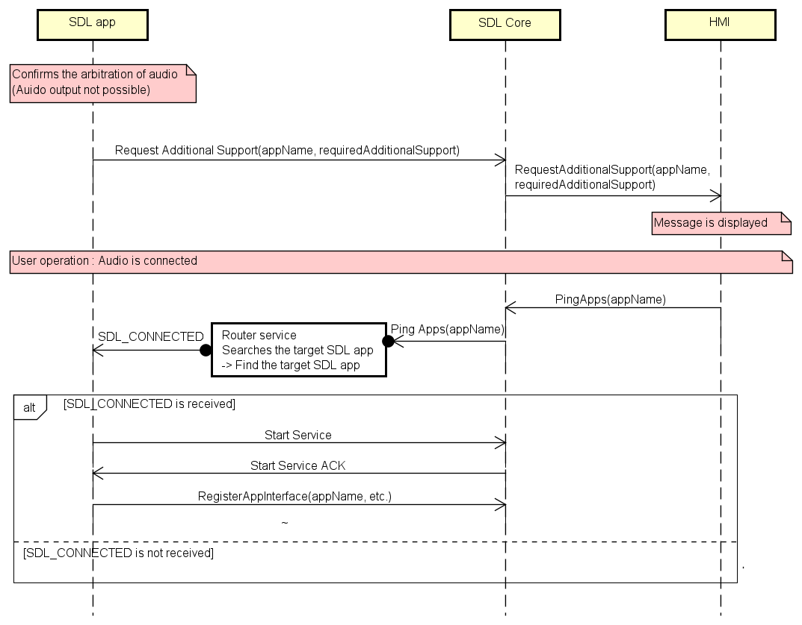

# Add Notifications for Required App Support

* Proposal: [SDL-0343](0343-Addition-of-a-way-to-notify-HMI-of-the-required-support-for-apps.md)
* Author: [Akihiro Miyazaki (Nexty)](https://github.com/Akihiro-Miyazaki)
* Status: **In Review**
* Impacted Platforms: [ Core / Java Suite / HMI /  Protocol ]

## Introduction
This proposal is to provide a way to notify the HMI of the required support for apps by using new notification messages.


## Motivation
If the system does not have something required to support certain apps, those apps may not work properly or be able to register. For example, in the case of Android OS, if a Media app connects via only USB, since the system cannot establish the audio path, the Media app cannot play audio and arbitrarily does not register. As a result, the HMI cannot tell the user why the app was not registered. To solve these problems, we propose to add a new notification message to let the HMI know the support that the SDL app needs. By doing so, this will allow the HMI to display the appropriate message and apps' connectivity and operability will be improved.


## Proposed solution
To provide a way to notify the HMI of the required support for apps, we will add new notification messages `Request Additional Support` and `Ping Apps` to the Protocol Spec and new RPCs `RequestAdditionalSupport` and `PingApps` to the HMI_API.

### Protocol Spec
The message `Request Additional Support` has two parameters: `appName` and `requiredAdditionalSupport`. Also, the message `Ping Apps` has a parameter called `appName`. The descriptions of these parameters are shown below.

<b>Table 1.</b> Additional Frame Info Definitions on Protocol Spec

| FRAME INFO VALUE | NAME | DESCRIPTION |
| :- | :- | :- |
| 0x0a | Request Additional Support | Requests the additional support that an SDL app needs. |
| 0x0b | Ping Apps | Notifies the required app of the support available. |

<b>Table 2.</b> The parameters of `Request Additional Support` on Protocol Spec

| Tag Name | Type | Introduced | Description |
| :- | :- | :- | :- |
| appName | String | 5.5.0 | The name of the SDL app that needs the additional support. |
| requiredAdditionalSupport | String Array | 5.5.0 | An array of the additional support names which the SDL app needs.<br>- audioSupport<br>- highBandwidth |

Note that the following additional support items are described.
 - audioSupport : To add `audioSupport` to the parameter of `requiredAdditionalSupport` if the system does not have the ability to play audio when an app that needs to play audio, such as a Media app, is registered.
 - highBandwidth : To add `highBandwidth` to the parameter of `requiredAdditionalSupport` if the system does not have the required high bandwidth when an app that needs the video projection, such as a Navigation app, is registered.
This feature is expandable by adding the corresponding string for the additional support that the SDL app needs.

<b>Table 3.</b> The parameters of `Ping Apps` on Protocol Spec

| Tag Name | Type | Introduced | Description |
| :- | :- | :- | :- |
| appName | String | X.X.X.X | The name of the SDL app that uses the additional support. |

### HMI_API
The HMI_API function `requestAdditionalSupport` has two parameters: `appName` and `requiredAdditionalSupport`. Also, the HMI_API function `pingApps` has a parameter called `appName`. The descriptions of these parameters are shown below.

```xml
+   <function name="RequestAdditionalSupport" messagetype="notification">
+       <description>Notification from SDL to HMI to notify the additional support that the SDL app needs.</description>
+       <param name="appName" type="String" maxlength="100" mandatory="true">
+           <description>The name of the SDL app that needs the additional support.</description>
+       </param>
+       <param name="requiredAdditionalSupport" type="String" minsize="0" maxsize="100" maxlength="100" array="true" mandatory="true">
+           <description>An array of the additional support names which the SDL app needs. For example, `audioSupport` or `highBandwidth`.</description>
+       </param>
+   </function>

+   <function name="PingApps" messagetype="notification">
+       <description>Notification from HMI to SDL that the required support for apps is available.</description>
+       <param name="appName" type="String" maxlength="100" mandatory="true">
+           <description>The name of the SDL app that uses the additional support.</description>
+       </param>
+   </function>
```

### Modification of Router Service
To implement this proposal, it is necessary to modify the Router Service as follows.
 - Receive the Protocol Spec message `Ping Apps` from SDL Core.
 - Search for the target SDL app using the `appName` parameter within the `Ping Apps` message.
 - Send the `SDL_CONNECTED` message to the target SDL app.

### Sequence diagram of the way to notify HMI of the required support for apps
Figure 1 shows the sequence diagram for notifying the HMI of the required support for apps.

<b>Figure 1.</b> Sequence diagram of the way to notify HMI of the required support for apps



The sequence is described as follows.
1. SDL app confirms whether or not it has the support that it needs.
2. SDL app sends to SDL Core the Protocol Spec message `Request Additional Support` if the required support for apps is not enough.
3. SDL Core sends HMI the RPC `RequestAdditionalSupport`.
4. HMI displays to the user a message that support is enough.
5. User performs the action to achieve the required support for apps according to displayed message.
6. If the HMI detects that it meets the required support for the app, it sends SDL Core the RPC `PingApps`.
7. SDL Core sends the Protocol Spec message `Ping Apps` to the Router Service in the app library.
8. The Router Service searches for the target SDL app using the parameter `appName` within the `Ping Apps` message.
9. The Router Service sends the target SDL app the `SDL_CONNECTED` message.
10. SDL app performs the proccess of its registration.


## Potential downsides
OEM should implement the method to display the message on their HMI.


## Impact on existing code
To add new control frame messages and HMI_APIs, this proposal affects SDL Core, Java Suite, HMI, and Protocol.


## Alternatives considered
The author was unable to consider any alternative approaches.
